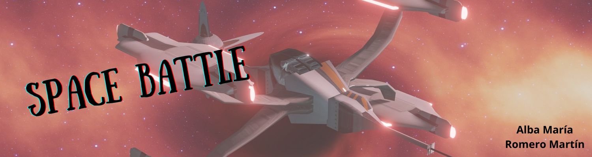

# (ESP) Batalla Espacial

Este juego de Batalla Espacial esta basado en el clásico y conocido "Hundir la Flota", pero en este caso, y como cabría esperarse por el nombre, el juego desarrolado en Python está ambientado en el espacio.

## Funcionamiento del juego

- **Jugadores:** El juego está pensado para dos jugadores: el usuario y la máquina.
- **Tablero:** Se utiliza un tablero de 10x10 para posicionar las naves.
- **Colocación de las naves:** Existen naves de diferentes longitudes: 4 naves de 1 eslora, 3 naves de 2 esloras, 2 naves de 3 esloras y 1 nave de 4 esloras; y todos se colocan de manera aleatoria en el tablero, tanto las naves del usuario como las de la máquina.
- **Turnos:** El juego funciona por turnos, comenzando siempre el usuario.
- **Disparos:** En cada turno, el jugador dispara a una coordenada del tablero del oponente. La máquina hará disparos a coordenadas de manera aleatoria.
- **Fin del juego:** El juego termina cuando todas las naves de un jugador han sido derrotadas.

## Desarrollo del juego

El desarrollo del juego se divide en los siguientes elementos:

1. **Variables:** Se definen las constantes en el archivo `variables.py` para las dimensiones del tablero y las características de las naves.
2. **Clases:** Se implementa la `Clase Tablero` en el archivo `clases.py` que gestiona la colocación de las naves, los disparos y el estado del juego.
3. **Funciones:** Las funciones auxiliares se encuentran en el archivo `funciones.py` y se utilizan para diversas tareas durante la ejecución del juego.
4. **Programa Principal:** El programa principal se encuentra en el archivo `main.py` y contiene el bucle principal del juego, donde se solicitan las coordenadas al usuario y se realizan los disparos.

## Ejecución del juego

Para ejecutar el juego, simplemente se debe correr el archivo `main.py` que se encuentra dentro de la carpeta `Batalla_Espacial`. Se proporcionarán instrucciones durante la ejecución para guiar al usuario a través del juego.

# (ENG) Space Battle

This Space Battle game is based on the classic and well-known "Sink the Fleet", but in this case, and as you would expect from the name, the game developed in Python is set in space.

## How the game works

- **Players:** The game is intended for two players: the user and the machine.
- **Board:** A 10x10 board is used to position the ships.
- **Placement of the ships:** There are ships of different lengths: 4 ships of 1 length, 3 ships of 2 lengths, 2 ships of 3 lengths and 1 ship of 4 lengths; And they are all randomly placed on the board, both the user's ships and the machine's ships.
- **Turns:** The game works in turns, always starting with the user.
- **Shots:** On each turn, the player shoots at a coordinate on the opponent's board. The machine will shoot at random coordinates.
- **End of game:** The game ends when all of a player's ships have been defeated.

## Game Development

The development of the game is divided into the following elements:
1. **Variables:** The constants are defined in the `variables.py` file for the dimensions of the board and the characteristics of the ships.
2. **Classes:** The `Clase Tablero` is implemented in the `clases.py` file which manages ship placement, firing, and game status.
3. **Functions:** The helper functions are located in the `funciones.py` file and are used for various tasks during the execution of the game.
4. **Main Program:** The main program is located in the `main.py` file and contains the main loop of the game, where the coordinates are requested from the user and the shots are made.

## Game Execution

To run the game, simply run the `main.py` file that is located inside the `Space_Battle` folder. Instructions will be provided during execution to guide the user through the game.